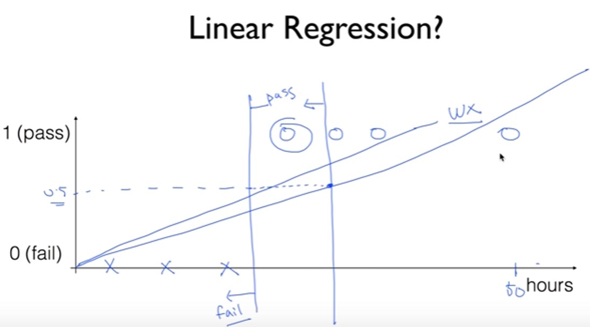
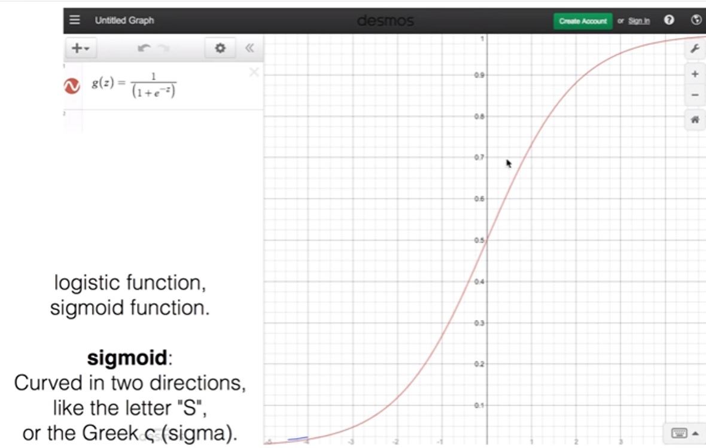

# Logistc Regression (Classification)

## Linear Regression의 한계

Linear Regression은 분류 문제에 적합하지 않다.

위의 그림에서 보면, 50시간 공부한 사람의 데이터가 들어감으로써, regression의 기울기가 급격히 기울게 된다. 또한, classification의 결과는 0 또는 1 이지만 Linear Regression의 hypothesis의 결과는 범위제한이 없다.

## Logistic Hypothesis

Linear Regression의 결과를 0과 1 사이로 압축 할 수 있는 좋은 function 없을까?

sigmoid function (=logistic function)을 이용!!

$$
z = W^T X \\ g(z) = \frac{1}{1+e^{-z}} \\ H(X) = g(z) = \frac{1}{1+e^{-W^TX}}
$$

## New Cost Function for Logistic Regression

기존의 mean square cost를 logist regression에 쓰려고 하면, non-convex가 되어서 문제가 있다. 그래서 아래와 같은 cost function을 사용한다.
$$
cost(W) = \frac{1}{m} \sum{c(H(x),y)} \\
c(H(x),y)= 
\left\{ 
\begin{matrix} 
-log(H(x)) \qquad\quad :y=1 \\
-log(1-H(x)) \quad\, :y=0
\end{matrix} 
\right.
$$
$y=1$일 때 $H(x)$가 0에 가까워지면, $c$는 무한대에 가까워진다. 반면에 $y=0$일 때는 $H(x)$가 1에 가까워 지면, $c$가 무한대로 가까워진다.

if 문을 없애기 위해 위의 식을 아래와 같이 바꿔서 사용 한다.
$$
c(H(x),y) = -ylog(H(x)) - (1-y)log(1-H(x))
$$

