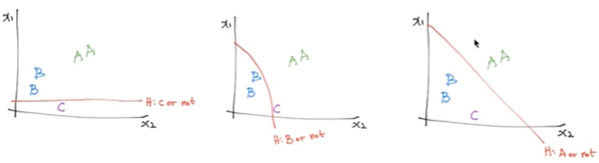
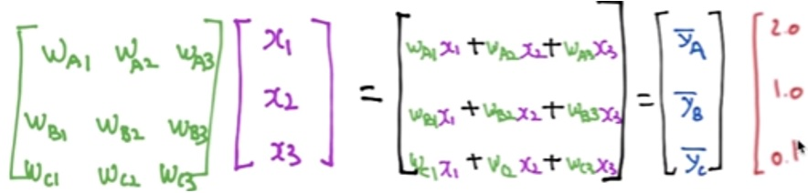
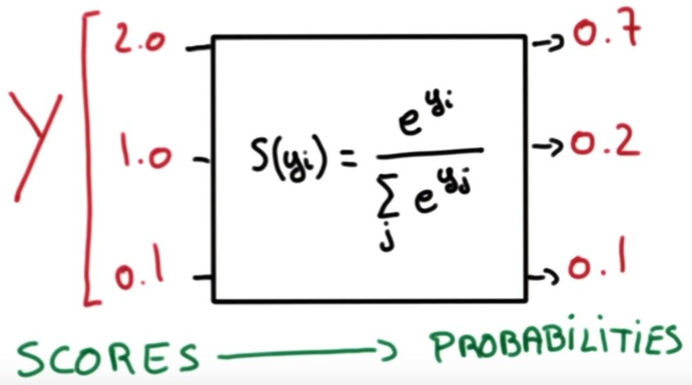
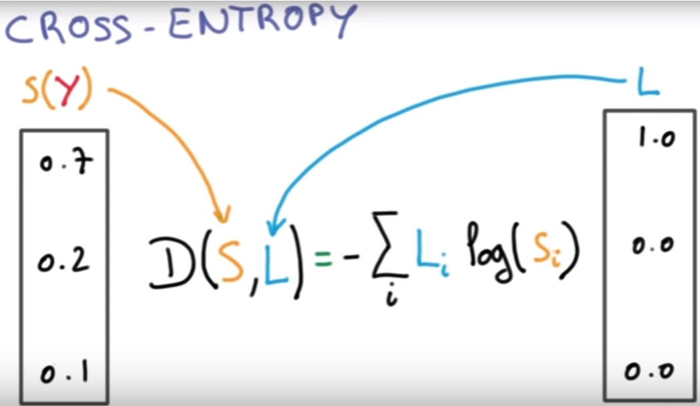
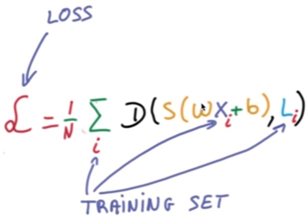

# Softmax Regression

여러 개의 class를 분류하는 Multinomial Classification의 대표적인 방법 중 하나이다.

이전에 배운 logistic regression을 이용한 분류는 결국 아래와 같이 input feature 공간에서 2개의 카테고리로 나누는 hyperplane을 만드는 셈이다.

카테고리가 늘어나면 아래와 같은 방식으로 판별 가능하다.

matrix form으로는 아래와 같다.

## Softmax

multi-category에선 score에 sigmoid를 적용하는 대신에, softmax 함수를 적용하면 확률값이 나온다.

## Cross Entropy

위에서 설계한 hypothesis를 fitting하기 위해서 사용하는 cost function을 구성할 때 Cross Entropy를 이용한다.

사실 이전에 보았던 logistic cost는 cross entropy의 특별한 경우이다.

## Cost function

각 샘플에 대한 cross entropy의 평균

convex 함.

### 궁금한 점

binary인 상황에서, ouput 하나로 두고 logistic regression하는 거랑, output 2개(one-hot)로 두고 softmax regression 하는 거랑 차이 있나?