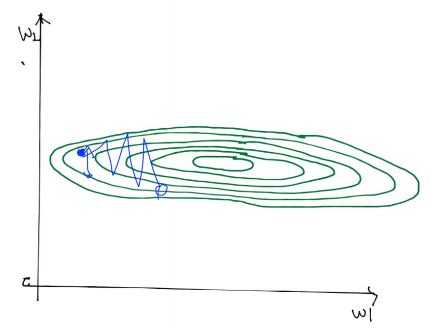
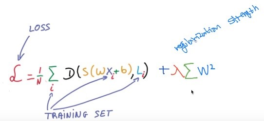

# Normalization

Input dim마다 scale이 다르면 (ex. 아래 그림), 같은 learning rate 주어졌을 때 상대적인 학습률이 다르므로, 항상 Normalization을 시켜줘야한다.

## Solutions for overfitting

- More training data
- Reduce the number of features
- Regularization

## Regularization

Weight가 큰 값을 가지게 되면, decision boundary가 구불구불 해지는 경향이 있다. 그러면, 아무래도 overfitting이 되기 때문에, cost function에 weight 벡터의 element들의 크기를 제한하는 term을 넣어서, weight를 작게 유지하는 방법을 regularization이라고 한다.

