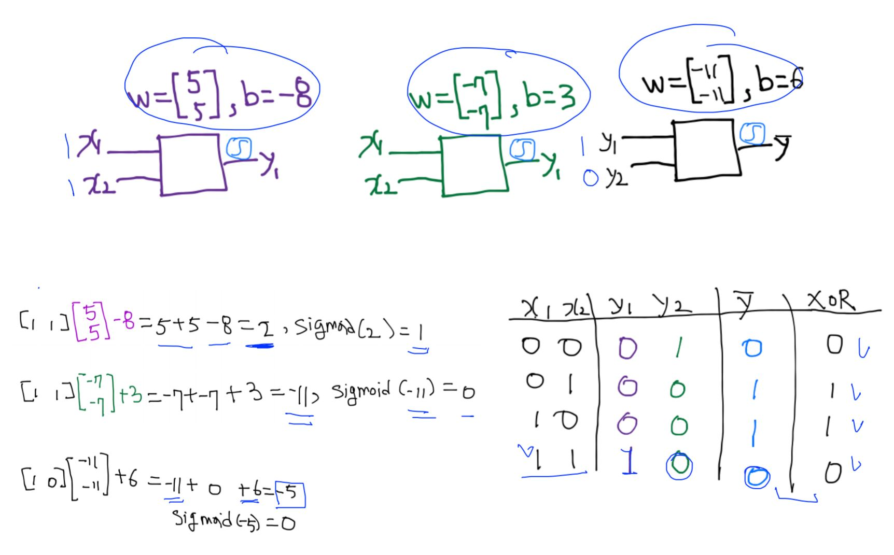
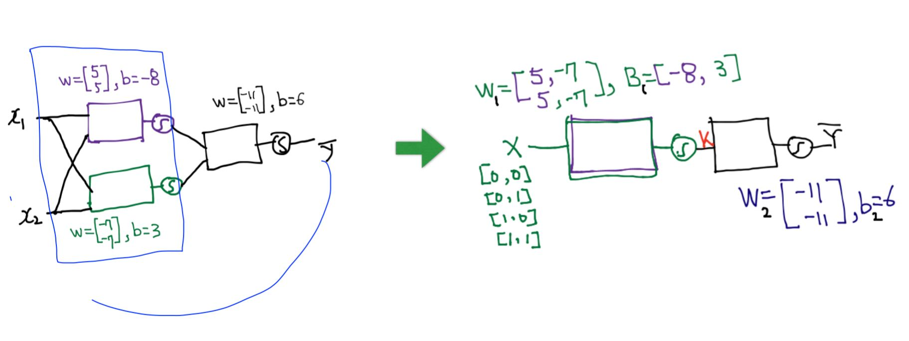
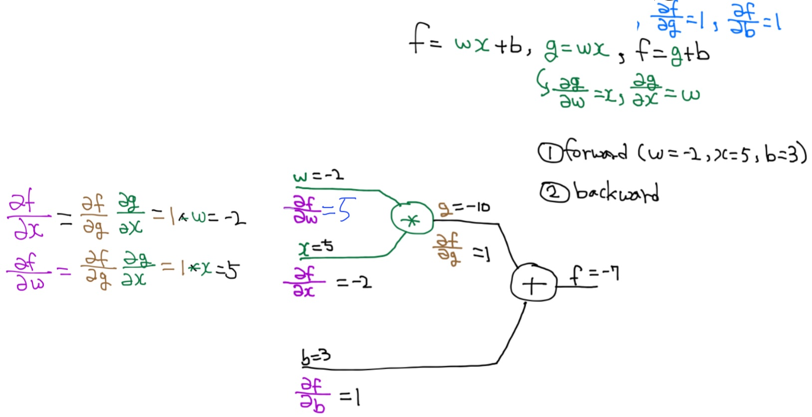
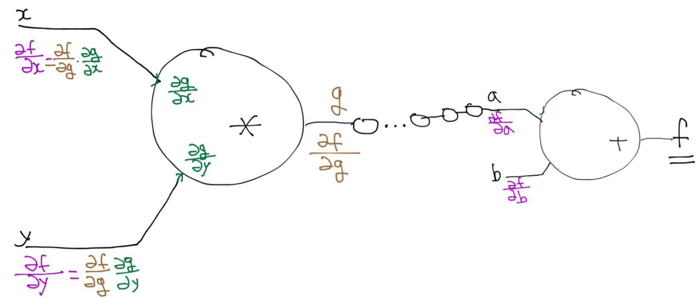
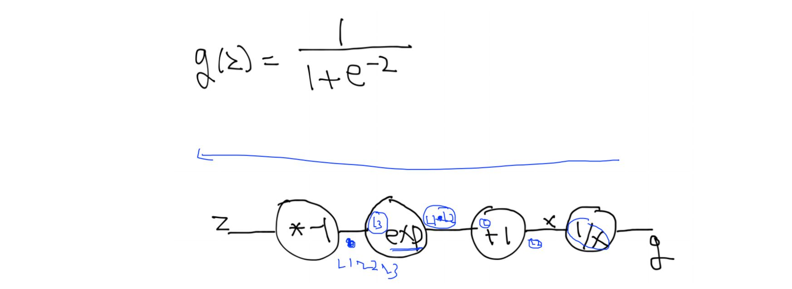
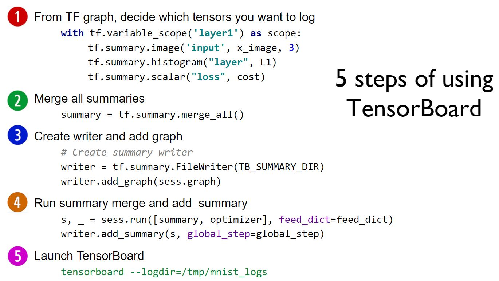

# 딥러닝 역사

### 마빈 민스키 (1969) said,

뉴럴넷 하나로는 XOR 문제를 풀 수 없고, Multi layer Perceptron 이어야 가능하다. 하지만, MLP를 학습할 수 없다고 얘기함.

### Paul Werbos (1974, 1982), Hinton (1986)

Error Backpropagation 발명으로 MLP training 가능해짐.

하지만, 깊은 MLP는 학습을 하지 못했고, (output에서의 error가 input 쪽으로 갈 수록 너무 미미해져서….)
오히려 간단한 SVM이나 RandomForest 같은 알고리즘들이 작동을 잘 했음.

### LeCun (1990)

그림의 부분부분 형태에 따라서 각기 다른 뉴런들이 활성화된다는 점에서 착안을 얻어서 CNN을 개발.

### Hinton (2006), Bengio (2007)

deep model들은 초기 weight를 현명하게 초기화시키면, 학습이 가능함을 밝혀냄. 이 때부터, 딥러닝이라는 단어가 많이 쓰임.

캐나다의 CIFAR라는 단체, 뉴럴넷이 전체적으로 암울한 상황이지만, Hinton이나 Bengio 같은 학자들을 계속 지원해줌으로써, 뉴럴넷 황금기의 큰 공로를 세움.

### ImageNet challenge 2012

Hinton 교수 연구실의 Alex 라는 대학원생, Alex Net 발명. (with ReLu)

# XOR 문제

한개의 layer로 풀수 없던 XOR문제는 아래와 같이 두개의 layer로 풀 수 있다.

같은 layer의 여러개의 뉴런은 이전에 Multinomial classification에서 배웠던 것 같이 Matrix Form으로 한꺼번에 표현 할 수 있다.

# Backpropagation

###### sigmoid도 아래와 같이 chain rule 적용

# Tensorboard

