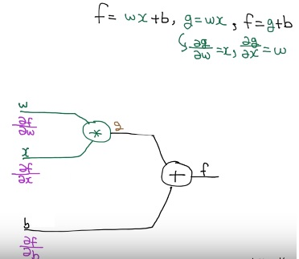
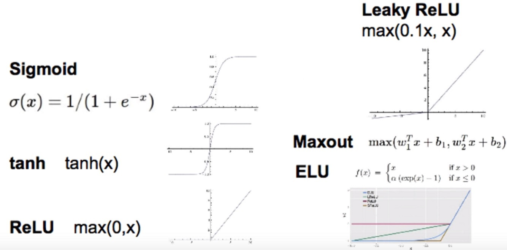
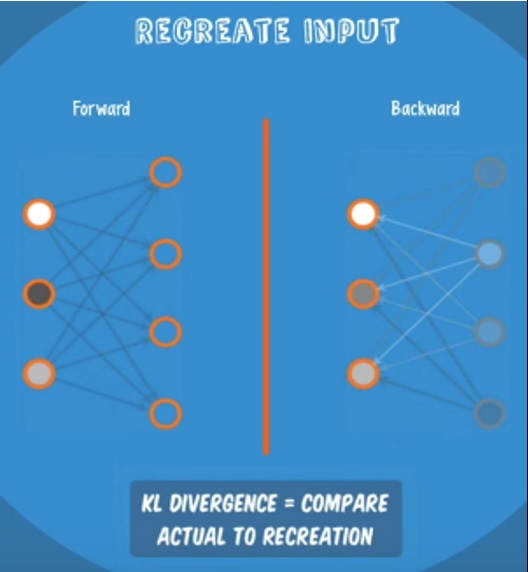
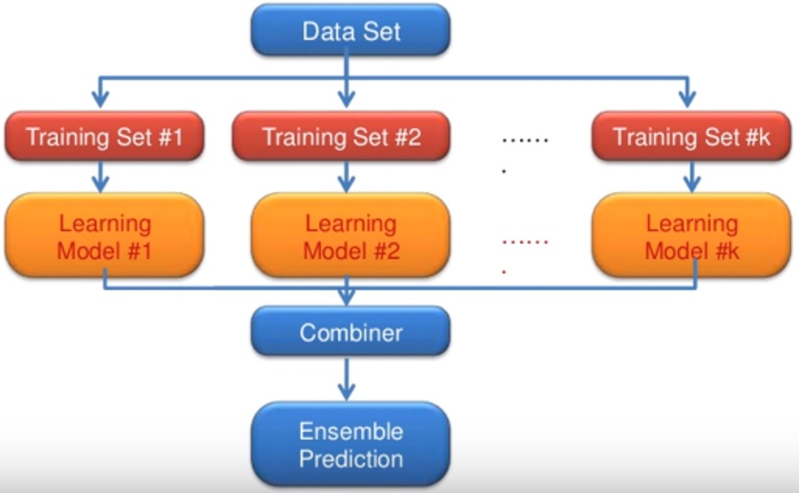

# 딥러닝 Tips

## sigmoid 보다 ReLU가 더 좋아

#### Vanishing gradient (NN의 겨울 2탄 : 1986-2006)

- sigmoid를 activation function으로 해서 deep하게 아키텍쳐 만들면 학습 불가
- backpropagation에서 입력단으로 갈수록 gradient가 줄어서 영향 미비
- 이유를 좀더 자세히 살펴보면, 아래의 뉴런그림에서 backpropagation 될 때, chain rule에 의해 $\frac{\partial f}{\partial w} = \frac{\partial f}{\partial g} \frac{\partial g}{\partial w} $ 인데, $\frac{\partial g}{\partial w} = x$ 이므로, sigmoid라면 값이 0과 1사이이다. input 단으로 갈수록, 0과 1사이의 값들이 chain rule에 의해서 계속 곱해지게 되고, gradient가  매우 작은 값을 가지게 된다.

#### sigmoid 대신 ReLu를 써서 해결

- sigmoid는 값이 1보다 커질 수 없지만, ReLu는 그렇지 않음
- 하지만 마지막 단은 sigmoid 계속 씀. (output 0에서 1사이 원하기 때문에)

#### 다양한 Actiation Functions

참고 : tanh는 sigmoid와 비슷하게 생기긴 했는데, output 범위가 [0,1]이 아니고 [-1,1]이라는 점이 다르다.

## Weight 초기화를 잘해보자.

모든 weight을 0으로 두면? 학습 절대 안됨.

#### Hinton(2006) "A Fast Learning Algorithm for Deep Belief Nets" (Restricted Boltzmann machine, RBM)

- 요새는 사용 잘 안 하긴 하지만..
- Forward (Encoder),  Backward (Decoder)
- RBM 학습 방법 : input값과, backward로 다시 만들어진 input 값이 최대한 가까워지도록 weight 조절

- Deep 러닝 초기화에의 적용
  - 인접한 레이어 간에 RBM을 이용하여 pre-training
  - 위와 같은 방식을 모든 레이어에 적용
  - Example - Deep Belief Network (weight initialized by RBM)
  - 특징!! - 라벨 값 필요 없음, unsupervised, input vector들만 있으면 됨.
  - 초기화 이후 Fine-tuning

#### 그 이후… 이제 RBM 없이 간단한 방법들 사용해도 가능

###### Xavier initialization : "Understanding the difficulty of training deep feedforward neural networks", 2010

- 각 노드의 input, output 개수를 기준으로 초기화
- W = np.random.randn(fan_in, fan_out)/np.sqrt(fan_in)

###### He's initialization : "Delving Deep into Rectifiers: Surpassing Human-Level Performance on ImageNet classification, 2015

- 위의 것에 아주 살짝 변경
- W = np.random.randn(fan_in, fan_out)/np.sqrt(fan_in/2)

###### 근데 이거 fc layer에만 해당하는 얘기인가? conv layer에서는 대충 초기화해도 되려나? 나중에 알아보기

## Dropout (오버피팅 회피)

- 우선 기본적으로 regularization을 써서 오버피팅 회피 가능 (weight 값 커지는 거 제한)
- Dropout
  - 학습할 때, 랜덤하게 노드(일종의 전문가)들을 kill => 학습에 사용하는 weight 갯수가 줄어드는 효과
  - 테스트 할 땐, 모든 노드(일종의 전문가)들 총동원
  - 구현 할 때, 테스트 할 시에는 꼭 dropout_rate : 1로 둘것

## 앙상블

위 그림에서, 모델만 다르게 트레이닝 셋은 같게 써도 된다.

## Optimizer

Adam 좋음.